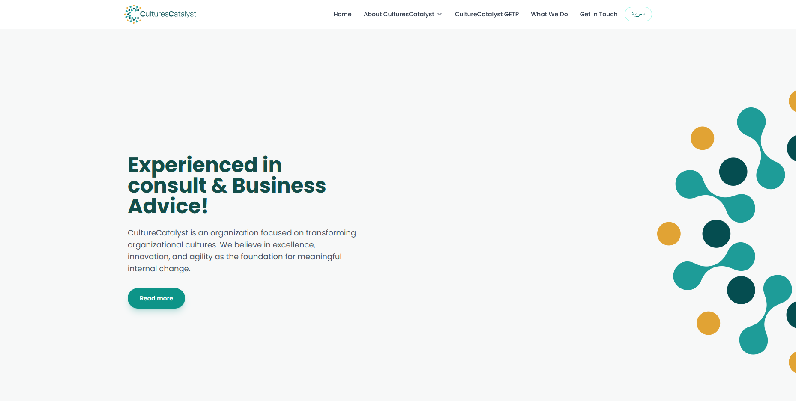

<div align="center">




### Transforming Cultures, Inspiring Excellence, Embracing Change

[]()
[]()
[]()
[]()
[]()

</div>

---

## About CultureCatalyst

CultureCatalyst is an organization focused on transforming organizational cultures. We believe in excellence, innovation, and agility as the foundation for meaningful internal change.

### Vision

> To be a global catalyst for cultural transformation, empowering organizations to achieve excellence through innovative and agile cultural practices that drive sustainable success.

### Mission

> To partner with organizations in transforming their cultures by delivering tailored strategies, leadership development, and innovative programs that align vision, values, and performance for lasting impact.

### Core Values

| Value | Description |
|-------|-------------|
| **Excellence** | We strive for the highest standards in everything we do, delivering exceptional quality and outcomes that exceed expectations. |
| **Innovation** | We embrace creativity and forward-thinking approaches to solve complex challenges and drive continuous improvement. |
| **Agility** | We adapt swiftly to change, enabling organizations to respond proactively to evolving demands and opportunities. |

---

## Features

- **English & Arabic** — Full bilingual support with complete translations
- **RTL Support** — Native right-to-left layout for Arabic pages
- **Founder & CEO Page** — Dedicated page with Abdullah Alshangiti's message and bio
- **GETP Page** — Global Educators Transformation Program landing page
- **Digital Business Card** — Shareable digital contact card with QR code
- **QR Code** — Auto-generated QR codes for easy contact sharing
- **Add To Contact (VCF)** — Downloadable vCard format for instant contact saving
- **Responsive Design** — Optimized for mobile, tablet, and desktop
- **SEO Optimization** — Meta tags, Open Graph, sitemap, and robots.txt
- **Google Analytics Ready** — GA4 integration with measurement ID configuration
- **PWA Ready** — Installable web app with manifest and icons
- **Maintenance Mode** — Built-in under-construction mode toggle
- **GitHub Pages Compatible** — Static build output for easy hosting

---

## Technology Stack

<div align="center">


</div>

---

## Website Structure

| Route | Page | Description |
|------|------|-------------|
| `/` | **Home** | Hero, About, Vision & Mission, Strategy, Culture Program, What We Do, Contact |
| `/founder-and-ceo-message` | **Founder & CEO Message** | Full bio and message from Abdullah Alshangiti |
| `/getp` | **GETP** | Global Educators Transformation Program details |
| `/business-digital-card` | **Digital Business Card** | Contact card with QR code and VCF download |
| `/under-construction` | **Under Construction** | Maintenance mode landing page |
| `/ar/*` | **Arabic Routes** | All pages mirrored with RTL Arabic layout |

---

## Screenshots

> Screenshots can be added by capturing the deployed site and placing them in a `docs/` or `public/screenshots/` directory.

| Page | Preview |
|------|---------|
| **Homepage** | _Add screenshot_ |
| **Founder Page** | _Add screenshot_ |
| **GETP** | _Add screenshot_ |
| **Digital Business Card** | _Add screenshot_ |
| **Mobile Navigation** | _Add screenshot_ |

---

## Configuration

All configuration is managed from single-source-of-truth files. No hardcoded values scattered across components.

### Site URL

```ts
// src/config/site-config.ts
export const siteUrl = 'https://culturescatalyst.com';
```

### Google Analytics

```ts
// src/config/analytics.ts
export const GA_MEASUREMENT_ID: string = 'G-XXXXXXXXXX';
```

Replace `G-XXXXXXXXXX` with your GA4 measurement ID. Analytics auto-enables when a valid ID is detected.

### Social Media Links

```ts
// src/config/socials.ts
export const socialLinks: SocialLink[] = [
  { platform: 'linkedin',  url: 'https://www.linkedin.com/company/culturescatalyst', label: 'LinkedIn' },
  { platform: 'facebook',  url: 'https://www.facebook.com/culturescatalyst', label: 'Facebook' },
  { platform: 'twitter',   url: 'https://twitter.com/culturescatalyst', label: 'X' },
  { platform: 'instagram', url: 'https://www.instagram.com/culturescatalyst', label: 'Instagram' },
  { platform: 'youtube',   url: 'https://www.youtube.com/@culturescatalyst', label: 'YouTube' },
  { platform: 'whatsapp',  url: 'https://wa.me/966500000000', label: 'WhatsApp' },
];
```

Update URLs in this one file — the desktop footer and mobile navigation both pull from this config automatically.

### Web3Forms

```ts
// src/components/sections/ContactSection.tsx
const WEB3FORMS_ACCESS_KEY = 'TODO_WEB3FORMS_ACCESS_KEY';
```

Replace with your Web3Forms access key to enable the contact form.

### Maintenance Mode

```ts
// src/config/site-config.ts
export const siteConfig = {
  siteMode: 'live' as SiteMode,  // 'live' | 'maintenance'
};
```

Set `siteMode` to `'maintenance'` to redirect all routes to the under-construction page.

---

## Deployment

### Getting Started

```bash
# Install dependencies
npm install

# Start development server
npm run dev

# Build for production
npm run build

# Preview the production build locally
npm run preview
```

### Supported Platforms

The project produces a static build in `dist/` that can be deployed to:

| Platform | Notes |
|----------|-------|
| **GitHub Pages** | Push `dist/` contents to `gh-pages` branch or use GitHub Actions |
| **Cloudflare Pages** | Set build command to `npm run build`, output directory to `dist` |
| **Netlify** | Set build command to `npm run build`, publish directory to `dist` |
| **Vercel** | Auto-detected Vite project — build and output configured automatically |
| **Traditional Hosting** | Upload `dist/` contents via FTP/cPanel to your web root |

---

## Project Status

| Status | Detail |
|--------|--------|
| **Production Ready** | Fully functional and deployed |
| **Responsive** | Mobile-first, tested across breakpoints |
| **SEO Optimized** | Meta tags, sitemap, robots.txt, Open Graph |
| **PWA Ready** | Manifest, icons, installable |
| **Bilingual** | English and Arabic with RTL support |

---

<div align="center">

**CultureCatalyst** &copy; 2026. All rights reserved.

Transforming Cultures, Inspiring Excellence, Embracing Change.

</div>
